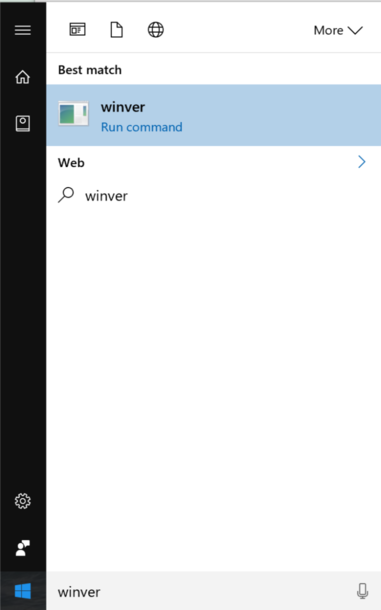
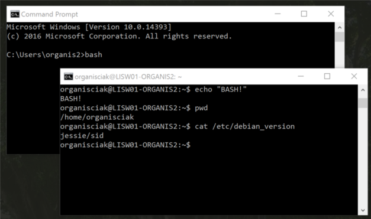
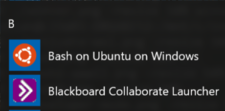

# Using Bash in Windows

For open-source technology, Windows users are often the odd ones out. 

If you open a command-line interface in Mac OS X, you'll see a Unix-like interface. Unix is a classic operating system that Apple based their system on, so the ways you interact with the system, the programs that are included, and the ways that developers can build new programs are all similar to how they would be on other Unix systems.

On Linux, the experience is very, very similar. This is because Linux was designed to look and act like Unix: many smart people wrote free versions of code that acts like Unix code, so again, your interaction, and programs. Importantly, the code to make many programs for one type of system will work for the other.

Windows does not have the same affordances, because it is not based on Unix. Windows instructions are often separate from Linux and Mac OS X instructions, and programs need to be specially adapted to work on Windows. Worse, in certain areas many of the developers creating programs do not use Windows, meaning that there is much less work done to make their code run well on Windows. Popular open-source programs like file-syncing utility `rsync`, remote login program `ssh`, and text editor `vim` were unavailable for Windows users for a long time.

There have been efforts, like Cygwin and MSYS2, to create a set of tools on Windows that look and act like Unix. These tools provide a subsystem that tries to translate Unix-speak to Windows-speak. Think of a conversation with somebody that doesn't speak your language, mediated by a translator. You may ask 'what time is it' in your language, the translator will repeat the question in the other person's language, then they will translate the response back to your language. For years, Cygwin or the related MSYS2 have saved Windows users that want to pretend - at least on the command line - that they're on Linux or Unix. However, there are system processes that Windows doesn't let anybody but itself hook into. Living within these restrictions, Cygwin is sometimes slower and missing some functionality. Cygwin users also find themselves needing to build (i.e. the process of making source code into a program) software for their system fairly often, a technical and sometimes time-consuming process that increases the complexity of running the program.

With the August 2016 release of Windows 10 Anniversary Edition, Microsoft has released a new way to use Linux in Windows: the _Windows Subsystem for Linux_ (WSL). It is faster and easier to use. Though still in beta, WSL already supports many system options that Linux or Unix programs want. Microsoft installs many of the fundamental programs of a Linux system automatically when you turn on WSL, as part of a 'distribution' called Ubuntu. This includes a command-line interface for interacting with the system in a console window (`bash`) and a package manager that lets you install a great deal of programs without having to build them from source code (`apt-get`). Though WSL is the way that Windows can talk like Linux, Ubuntu is the collection of Linux programs that you'll use, and Bash is the way to talk to interact with these in the command line, I'll refer to these parts collectively as Bash for Windows. 

Ian Milligan and James Baker have a beginner resource on Bash and command line interfaces at [Programming Historian](http://programminghistorian.org/lessons/intro-to-bash). This tutorial outlines how you can activate Bash for Windows on your own Windows 10 computer, after which it will be possible to follow along which Milligan and Baker's examples.

## Check Your Windows Version

Bash for Windows is only availabe in the newest version of Windows 10, as of August 2016, so outdated systems will not support it. To check if your system can run it, open Start Menu and type `winver` into search, then run the command that shows up at the top.



A window will appear with some information about your version of Windows. For Bash for Windows, the second line needs to say "Version 1607" or a higher number. If it is lower, you or an administrator need to update your system with Windows Update. From the Start Menu, go to _Settings > Update & security > Windows Update > Check for updates_.

## Activating WSL and running Bash

To use Bash for Windows, you need to turn on Developer Mode, and activate the Windows Subsystem for Linux. This requires administrator permissions.

1. **Turn on Developer Mode**. WSL is an advanced feature, which need to been allowed on your system. To do so, go to "Settings > Update & Security > For Developers" (or type 'For Developers' into Start Menu's search) and select Developer Mode.
2. **Activate WSL**. Open "Turn Windows Features On or Off" by searching in the Start Menu, then check the box for "Windows Subsystem for Linux".

Now that WSL is activated, you can use load Bash for Windows. Bash is installed the first time that you try to run it, so let's run it!

Open Command Prompt, which can be found by typing `cmd` into the Start Menu search. Command Prompt is a console that Microsoft provides: there are more customizeable or colorful alternatives that will also work, but this one is sufficient. In the console, type `bash` and press ENTER.



The first time your run this command, Windows will download and install Ubuntu - which includes Bash. Follow the prompts, during which you'll be asked to choose a username and password. Then, you're in!

# Trying out Bash

Starting Bash for Windows is the same each time: just type `bash` into a console. Windows also added a Start Menu icon for "Bash for Windows".



New users can try Milligan and Baker's Introduction to Bash, following instructions for Linux, and all the commands will work: `mv` to move files, `cp` to copy files, `vim` to edit files. You can read the instruction manuals for many commands with `man {command_name}`, which is useful given how powerful and extensive the suite of tools at your fingertips is. When you see instructions for command lines online, you can now follow the Linux (or specifically Ubuntu) instructions.

Additional programs can be installed using the `apt-get` package manager. For example, to install `git`, you can type:

```bash
$ sudo apt-get install git
```

Since you are installing things, the computer wants to make sure you have administrative privileges, just like Windows asks for an administrative password when you try to install something. This is why the command starts with `sudo`: this tells Linux to run apt-get as an all-powerful root user. In other words, the real command is `apt-get install git`, but you're telling the computer "run this as somebody more important". It's easy to break things as the all-powerful user, so don't get into the habit of prepending all commands with sudo. In fact, besides the command above, you'll notice that oftentimes people don't include `sudo` in online instructions, lest you accidentally copy/paste something.
